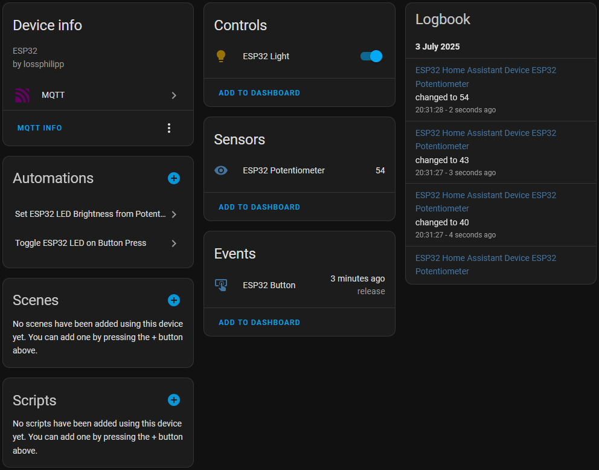

# Usage Guide

This document provides detailed instructions on how to use the ESP32 Home Assistant Integration project after completing the setup described in the README.

## Prerequisites

Before using this project, ensure you have completed the configuration steps outlined in the [README.md](../README.md):
- ESP32 firmware flashed and running
- WiFi connection established
- MQTT broker configured and accessible
- Home Assistant MQTT integration configured
- Device entities discovered in Home Assistant

## Device Overview

The ESP32 device provides three main components that integrate with Home Assistant:

### 1. RGB LED Control (`light.esp32_light`)
- **Function**: Full-color LED strip/matrix control
- **Capabilities**: 
  - On/Off control
  - RGB color selection
  - Brightness adjustment (0-255)
  - Real-time state feedback

### 2. Button Events (`event.esp32_button`)
- **Function**: Physical button interaction detection
- **Events**: 
  - Press events
  - Release events
  - GPIO identification

### 3. Potentiometer Sensor (`sensor.esp32_potentiometer`)
- **Function**: Analog value monitoring
- **Range**: 0-255 (8-bit resolution)
- **Update Rate**: Every 500ms
- **Use Cases**: Manual brightness control, analog input monitoring

## Using the Device in Home Assistant

### Basic LED Control

1. Navigate to **Settings** → **Devices & Services** → **Devices**
2. Find "ESP32 Home Assistant Device"
3. Click on the `ESP32 Light` entity
4. Use the controls to:
   - Toggle the light on/off
   - Adjust brightness with the slider
   - Change colors using the color picker

See the video 

### Monitoring Sensor Data

#### Potentiometer Values:
- View current value in **Developer Tools** → **States**
- Entity ID: `sensor.esp32_potentiometer`
- Create sensor cards on dashboard for real-time monitoring

#### Button Events:
- Monitor in **Developer Tools** → **Events**
- Event type: `event.esp32_button`
- Listen for `press` and `release` event types

## Available Automations

The project includes two pre-configured automations that demonstrate different interaction patterns. **Important**: These automations conflict with each other, so only enable one at a time.

### Automation 1: Potentiometer Brightness Control

**Purpose**: Use the physical potentiometer to control LED brightness

**Behavior**:
- Reads potentiometer value (0-255)
- Automatically adjusts LED brightness to match
- Provides tactile control without using Home Assistant interface

**To Enable**:
1. Go to **Settings** → **Automations & Scenes**
2. Find "Set ESP32 LED Brightness from Potentiometer"
3. Toggle the automation to **ON**
4. Ensure the button toggle automation is **OFF**

**Usage**:
- Rotate the potentiometer to see real-time brightness changes
- LED will maintain color but adjust brightness
- Works even when LED is controlled via Home Assistant

See the video 

### Automation 2: Button Toggle Control

**Purpose**: Use the physical button to toggle LED on/off

**Behavior**:
- Press button to toggle LED state
- Maintains current color and brightness settings
- Provides physical override for LED control

**To Enable**:
1. Go to **Settings** → **Automations & Scenes**
2. Find "Toggle ESP32 LED on Button Press"
3. Toggle the automation to **ON**
4. Ensure the potentiometer automation is **OFF**

**Usage**:
- Press the button to turn LED on/off
- LED remembers last color and brightness when turned back on
- Can be combined with Home Assistant control

See the video 

For additional technical details and setup instructions, refer to the main [README.md](../README.md) file.